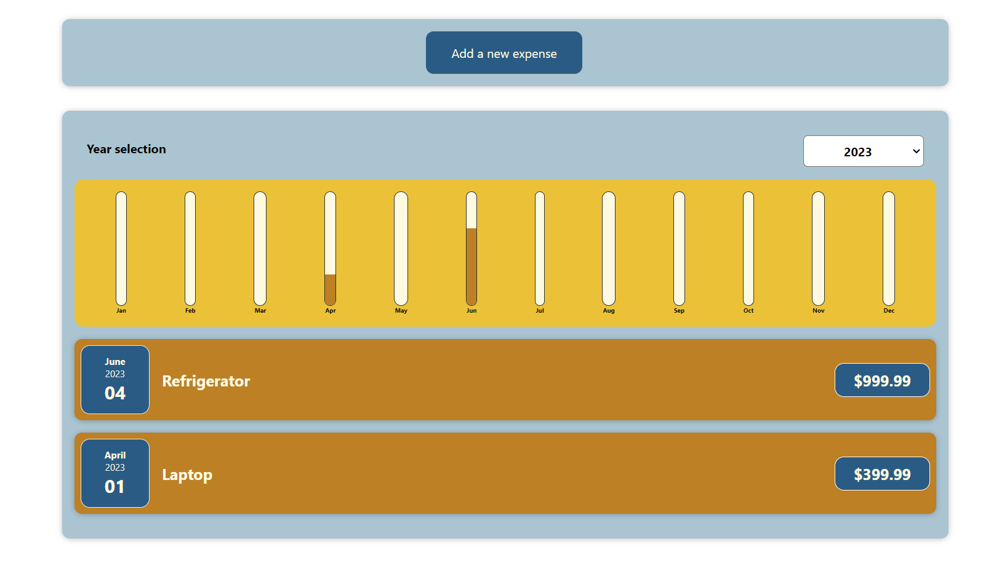
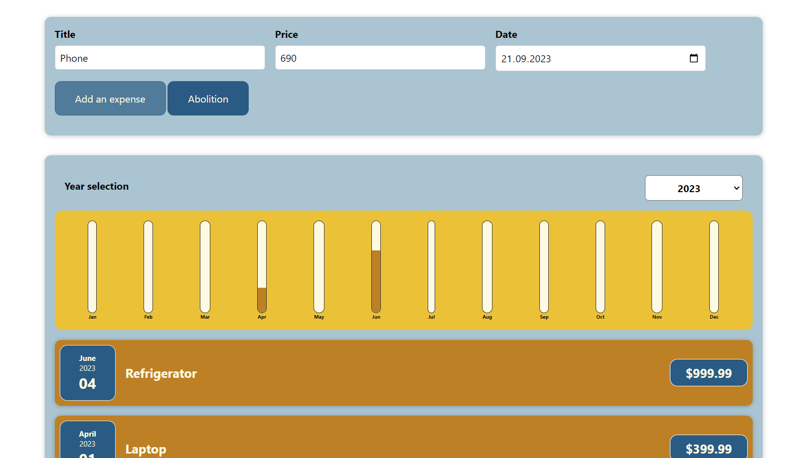
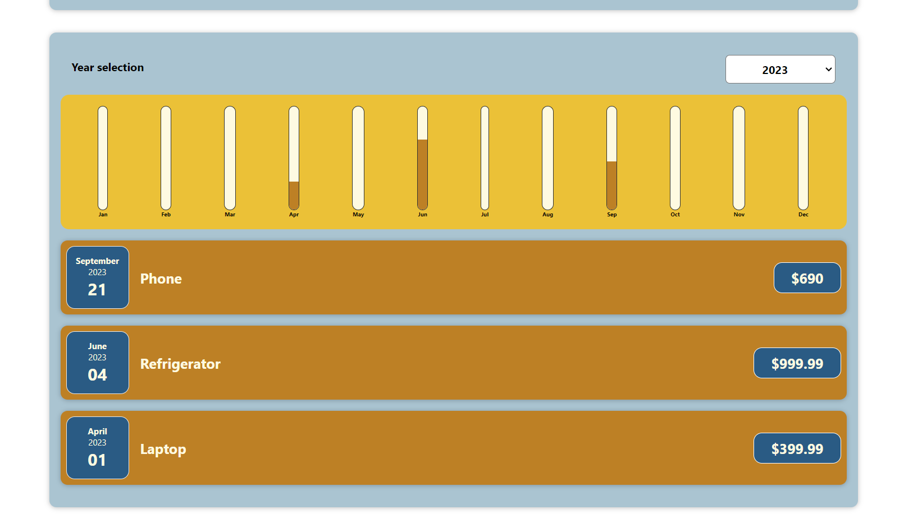

<h1 align="center">Expenses app</h1>

**`In this small application, you can add your cash expenses, indicate the amount and year of purchase. After that, the purchase will appear in the table and the schedule will change dynamically, you can also select the year yourself and see what you bought.`**  

<h1 align="center">Technologies</h1>

**`JavaScript`**  
**`React.js(JSX)`** 
**`CSS`**

<h1 align="center">Screenshots</h1>

